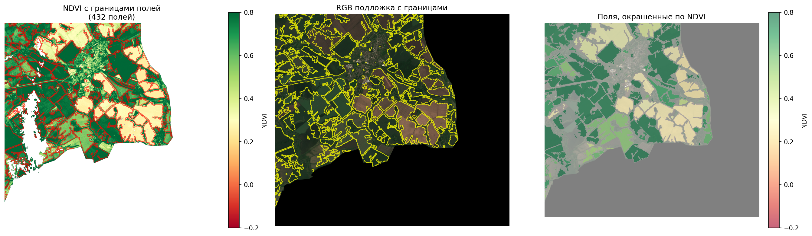

# Анализ спутниковых данных для решения прикладных задач сельскохозяйственного мониториинга

## Определение границ сельскохозяйственных полей

**Результат автоматической разметки полей**

## Что было выполнено

1. **Предобработка** — репроекция в EPSG:32637 (10 м), маскирование облаков (SCL+CLD), фильтрация SAR фильтром Ли, перевод в дБ.

2. **Расчёт признаков** — NDVI, SAVI, EVI, NBR, VV_gradient, VV_entropy, композитный градиент. Ранжирование по метрике Score (контраст + резкость + стабильность + бимодальность). Топ-3: VV_gradient (0.290), composite_gradient (0.272), laplacian_NDVI (0.231).

3. **Детекция границ** — композитная карта с весами [0.35, 0.30, 0.20, 0.15], бинаризация (85% перцентиль), морфология (closing/opening).

4. **Сегментация Watershed** — 1195 маркеров → 1195 сегментов → после фильтрации 432 поля.

5. **Векторизация** — экспорт в GeoPackage, GeoJSON с атрибутами: площадь (62 565 га), периметр, mean_NDVI (0.625), компактность (0.169).

## Результат

| Показатель | Значение |
|------------|----------|
| Выделено полей | 432 |
| Общая площадь | 62 565 га |
| Средняя площадь | 144.8 га |
| Медианная площадь | 42.2 га |
| Средний NDVI | 0.625 |
| Высокая вегетация (NDVI ≥ 0.6) | 59% полей |

*При отсутсвии возможности просмотра файла `analys.ipynb` - перейти для просмотра на [githab.dev](https://github.dev/seniaVV/analys_sputnik_data/blob/main/analys.ipynb)*